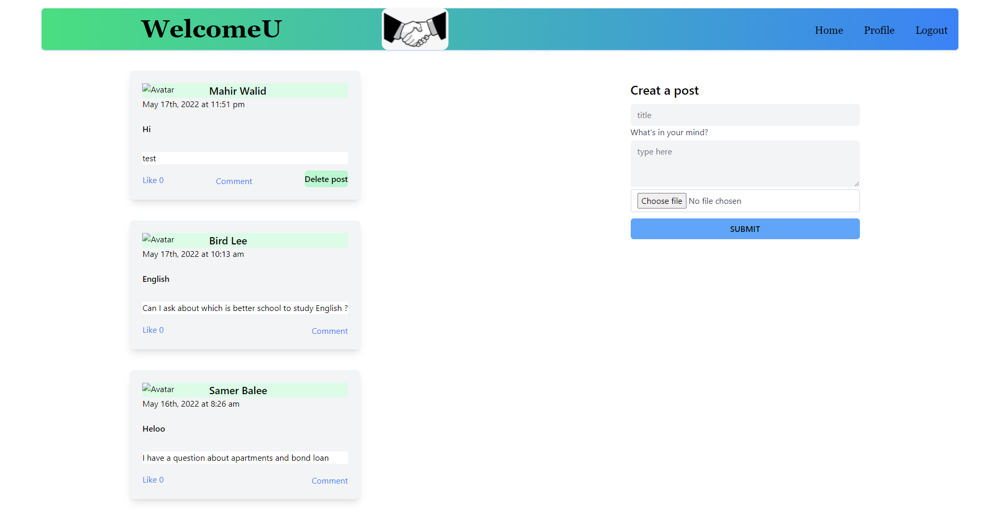
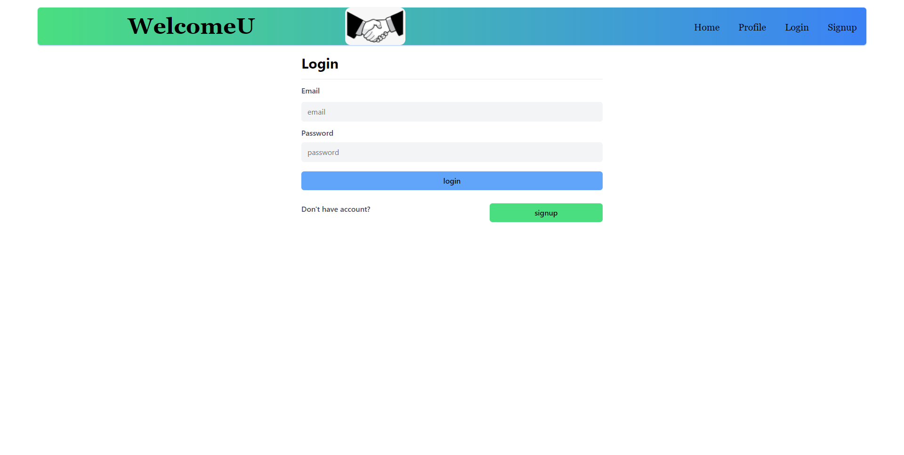
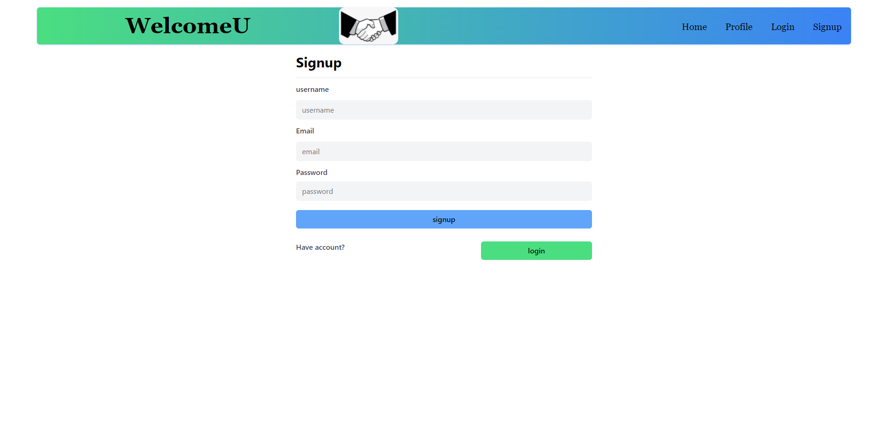
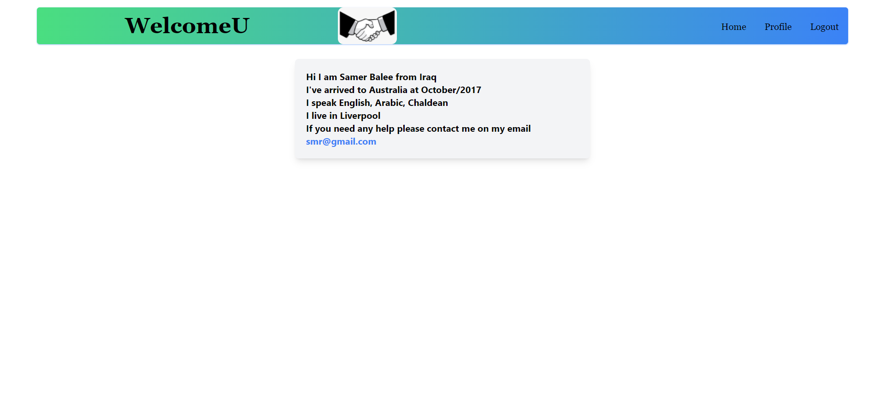

 # WelcomeU [](https://opensource.org/licenses/MIT)

  ## Description
   A social app built up with MERN full stack for immigrants to be able to find other immigrants that speak the same language or other immigrants that can relate to, share their posts, ask for any help and comments on any other posts.


  ## Tables of Contents
  * [Instalation](#instalation)
  * [Technologies](#technologies)
  * [User Story](#user-story)
  * [Acceptance Criteria](#acceptance-criteria)
  * [Usage](#usage)
  * [License](#license)
  * [Contributing](#contributing)
  * [Tests](#tests)
  * [Questions](#questions)
   
  ## Instalation
   
   A link to the App deployed in Heroku is here : [WelcomeU](https://welcomeu.herokuapp.com/) 

  ## Technologies

  * JavaScript
  * Tailwind CSS
  * Node.Js
  * Express.js
  * React
  * MongoDb
  * GraphQl
  * JWT

  ## User Story

  ```md
    As an immigrant I want to be able to find other immigrants that speak the same language or other immigrants that I can relate to.
  ```

  ## Acceptance Criteria

  ```md
GIVEN a platform
WHEN I load the home page 
THEN I’m presented with a feed of other immigrants’ posts and I can only browse/scroll this feed.
WHEN I click on the name of post owner 
THEN I can view information about them, (from where, when they arrived, what languages they speak, where they live and their email address to contact them).
WHEN I click on the Login/Signup menu option 
THEN a modal appears on the screen with a toggle between the option to log in or sign up 
WHEN the toggle is set to sign up 
THEN I am presented with three inputs for a username, an email address, and a password, and a signup button.
WHEN the toggle is set to Log in 
THEN I am presented with two inputs for an email address, a password and login button.
WHEN I enter a valid username, a valid email address and create a password and click on the signup button
THEN my user account is created and I am logged in to the site.
WHEN I enter my account’s email address and password and click on the login button
THEN the modal closes and I am logged in to the site 
WHEN I am logged in
THEN a post for form appears in home page and I am able to create a post
WHEN I fill the post form fields and click on the submit button
THEN my post is created and listed with posts feed with a button to delete my post.
WHEN I click on comment link for any post
THEN a modal appears on the screen with the post and all comments on it and a comment form with two inputs for a comment and my username and add a comment button. 
WHEN I fill the comment form and click add comment 
THEN my comment appears in the comments feed with a small button to delete my comment.
WHEN I click on the Logout button
THEN I am logged out of the site and presented with the home/feed page, profile and Login/Signup

  ```

  ## Usage

  -Screenshot-1:



  -Screenshot-2:



  -Screenshot-3:



  -Screenshot-4:


   

  
  ## License
   For information about this license visit: [MIT](https://opensource.org/licenses/MIT)

  ## Contributing
   No contribution

  ## Tests
   No test

  ## Questions
  My GitHub link: [Samer-Balee](https://github.com/Samer-Balee)

  If you have any questions, please e-mail me at samerbalee@gmail.com
